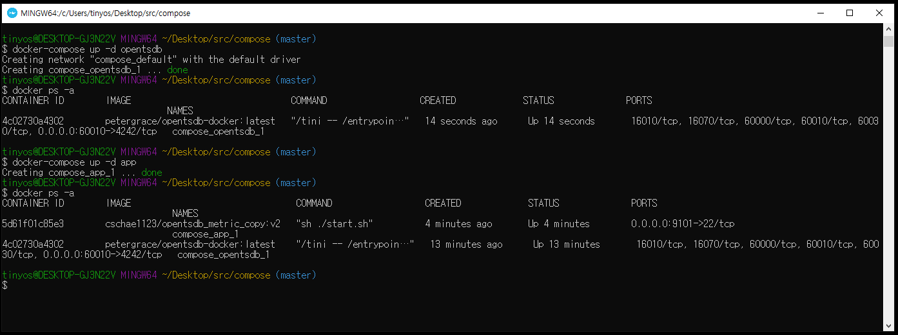
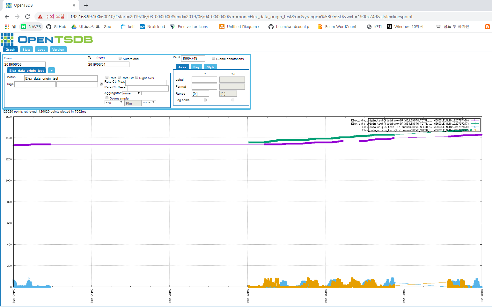

# opentsdb_metric_copy

특정 opentsdb의 metric을 쿼리해 리턴되는 데이터를 본인이 실행하는 docker container opentsdb로 복사

## 사전준비
  1.  docker/docker-compose 설치
      https://hcnam.tistory.com/25
  2. 윈도우 docker/docker-compose 설치
      https://steemit.com/kr/@mystarlight/docker

## 사용방법
  1. github repo clone 혹은 zip파일 다운로드
  
      - git clone
      
            git clone https://github.com/ChulseoungChae/opentsdb_metric_copy.git
          
        or
      
      - 아래링크에서 zip파일 다운로드
      
          [Link(https://github.com/ChulseoungChae/opentsdb_metric_copy/releases)](https://github.com/ChulseoungChae/opentsdb_metric_copy/releases)
          
  2. compose 디렉토리로 이동
  
          cd compose
  
  3. docker-compose.yml파일 수정(수정할 내용은 하단에 기재)
      - 필수 수정부분 설명
            
            app:   
              #ssh 접속을 위한 포트 설정
              ports:
                  - "원하는 포트:22"
              #/compose/app_volume과 볼륨공유를하여 app_volume내의 파일들을 수정하면 app 컨테이너 내부의 파일도 동일하게 수정된다
              volumes:
                  - "<compose 깃헙 레포를 다운받은 경로+/compose/app_volume>:/app/apps/00_otsdb_copy/"
              #데이터를 입력할 TSDB의 ip를 써놓는것, opentsdb 컨테이너를 실행하면 web주소는 http://<host_ip>:<60010>가 되기때문에 이부분은 
              host ip(혹은 docker-toolbox ip)를 써주면된다
              environment:
                  - IP_ADDRESS=<host_ip 혹은 docker-toolbox_ip>
                  

  4. docker-compose로 opentsdb container 실행

          docker-compose up -d opentsdb

  5. 1분 대기

  6. docker-compose로 opentsdb copy container 실행

          docker-compose up -d app

  - docker compose 실행 과정 그림

    

## docker-compose.yml파일 수정
  docker-compose.yml

        # Author : ChulseoungChae

        version: '3'

        services: 
            opentsdb:
              image: petergrace/opentsdb-docker:latest
              restart: always
              ports:
                  - "60010:4242"
              #environment:
              #    - WAITSECS=30   

            app:
              image: cschae1123/opentsdb_metric_copy:v2
              ports:
                  - "원하는 포트:22"
              volumes:
                  - "<compose 깃헙 레포를 다운받은 경로+/compose/app_volume>:/app/apps/00_otsdb_copy/"
              environment:
                  - IP_ADDRESS=<host ip 혹은 docker-toolbox ip>
                  
   ex)

        # Author : ChulseoungChae

        version: '3'

        services: 
            opentsdb:
              image: petergrace/opentsdb-docker:latest
              restart: always
              ports:
                  - "60010:4242"
              #environment:
              #    - WAITSECS=30   

            app:
              image: cschae1123/opentsdb_metric_copy:v2
              ports:
                  - "9101:22"
              volumes:
                  - "/c/Users/tinyos/Desktop/src/compose/app_volume:/app/apps/00_otsdb_copy/"
              environment:
                  - IP_ADDRESS=192.168.99.100
                  
## 코드 수정
  docker-compose.yml 파일에서 app의 볼룸공유 디렉토리의 원하는 파일 editor로 수정가능

## 수정한코드 실행
    docker restart <app container name>
  
## 컨테이너 ssh 접속
    ssh root@[<호스트 ip> or <docker-toolbox ip>] -p <사용자가 지정한 포트번호>
    
    
## 실행결과

  - opentsdb web 접속

      http://<host_ip>:<60010>
      
  - 아래 정보 입력
      
        From : 2019/06/03
        To : 2019/06/04
        Metric : Elex_data_origin_test
        Aggregator: None	

      
