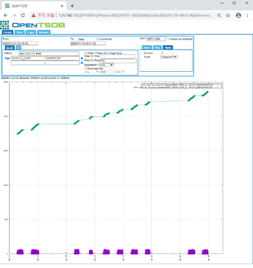

# apps

특정 opentsdb의 metric을 쿼리해 리턴되는 데이터를 본인이 실행하는 docker opentsdb container로 복사하고 전처리후 다시 opentsdb에 data put

## 사전준비
  1.  docker/docker-compose 설치
      https://hcnam.tistory.com/25
  2. 윈도우 docker/docker-compose 설치
      https://steemit.com/kr/@mystarlight/docker

## 사용방법
  1. github repo clone 혹은 zip파일 다운로드
  
      - git clone
      
            $ git clone https://github.com/ChulseoungChae/docker-compose.git 

        or
      
      - 아래링크에서 zip파일 다운로드 후 압축해제, 원하는 디렉토리로 
      
          [Link(https://github.com/ChulseoungChae/docker-compose/releases)](https://github.com/ChulseoungChae/docker-compose/releases)
          
  2. compose 디렉토리로 이동
  
          $ cd docker-compose/apps/compose 
  
  3. docker-compose.yml파일 수정(수정할 내용은 하단에 기재)
      - host ip 확인
             
            리눅스 – ifcongif
            윈도우(cmd/powershell) – ipconfig
            윈도우(docker-toolbox) – docker machine ip

      - 필수 수정부분 설명
            
            opentsdb:
                ports : opentsdb접속 포트:4242

            app:
                ports : container ssh접속 포트:22
                environment:
                    IP_ADDRESS : host ip
                    PORT : opentsdb 접속포트

            app2:
                ports : container ssh접속 포트:22
                environment:
                    IP_ADDRESS : host ip
                    PORT : opentsdb 접속포트

  4. docker-compose로 opentsdb container 실행

          docker-compose up -d opentsdb

  5. 1분 대기

  6. docker-compose로 metric copy 컨테이너 실행 및 결과확인

          $ docker-compose up -d app_copy

        - 코드 수정 및 실행

                cd app_copy_volume/      # 디렉토리 이동
                vim this_run.sh                # 코드 수정
                docker ps –a                    # 컨테이너 Name 확인
                docker exec <컨테이너 name> bash /app/apps/00_otsdb_copy/this_run.sh   # 실행
        
        - opentsdb web 접속 확인(아래 정보 선택 및 입력)

                From : 2020/01/01
                To : 2020/01/15
                Metric : Elex.2020.01.test2
                Aggregator: None

            

  7. docker-compose로 주행구간 추출 컨테이너실행 및 결과확인

          $ docker-compose up -d app_get_driving 

        - 코드 수정 및 실행

                cd app_get_driving_volume/      # 디렉토리 이동
                vim this_run.sh                # 코드 수정
                docker ps –a                    # 컨테이너 Name 확인
                docker exec <컨테이너 name> /app/apps/02_otsdb_get_drive_startend/this_run.sh   # 실행

        
        - opentsdb web 접속 확인(아래 정보 선택 및 입력)

                From : 2020/01/01
                To : 2020/01/15
                Metric : Elex.2020.01.driving_startend_2
                Aggregator: None
            
            

## 코드 수정
  docker-compose.yml 파일에서 app의 볼룸공유 디렉토리의 원하는 파일 editor로 수정가능

## 수정한코드 실행
    docker exec <app container name> bash <실행 sh 파일 이름>
  
## 컨테이너 ssh 접속
    ssh root@[<호스트 ip> or <docker-toolbox ip>] -p <사용자가 지정한 포트번호>
