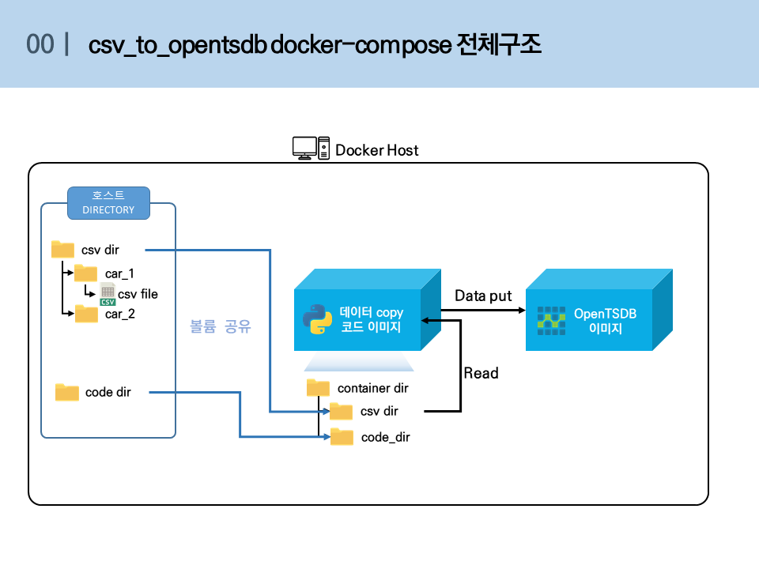
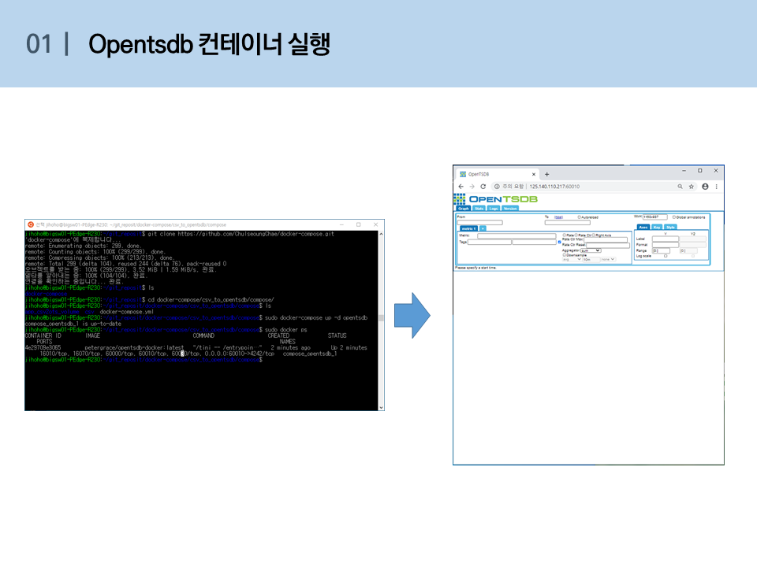
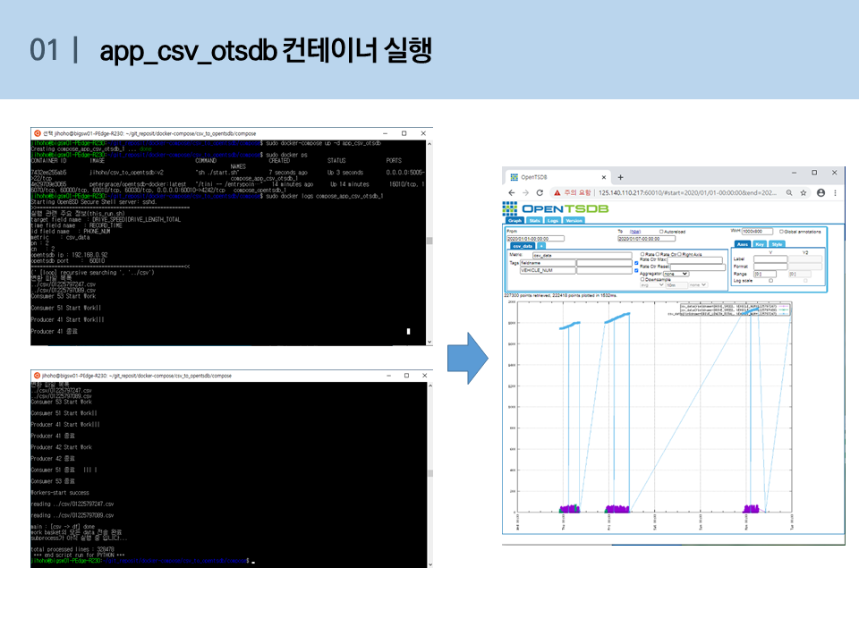

# csv_to_opentsdb

host에서  csv 파일을 읽어 docker opentsdb container로 push

## 사전준비
  1.  docker/docker-compose 설치
      https://hcnam.tistory.com/25
  2. 윈도우 docker/docker-compose 설치
      https://steemit.com/kr/@mystarlight/docker


## 사용방법
  1. github repo clone 혹은 zip파일 다운로드
  
      - git clone
      
            $ git clone https://github.com/ChulseoungChae/docker-compose.git
        
        or
      
      - 아래링크에서 zip파일 다운로드 후 압축해제, 원하는 디렉토리로 
      
          [Link(https://github.com/ChulseoungChae/docker-compose/releases)](https://github.com/ChulseoungChae/docker-compose/releases)
      
  2. csv_to_opentsdb compose 디렉토리로 이동
  
            $ cd docker-compose/csv_to_opentsdb/compose/
  
  
  3. docker-compose.yml파일 수정(수정할 내용은 하단에 기재)

      - host ip 확인

            리눅스 – ifcongif
            윈도우(cmd/powershell) – ipconfig
            윈도우(docker-toolbox) – docker machine ip

      - 필수 수정부분 설명
        
        
        
        ```
        # Author : HojunJi
        
        version: '3'
        
        services: 
            opentsdb:
              image: petergrace/opentsdb-docker:latest
              restart: always
              ports:
                  - "[포트포워딩 포트]:4242"
              #environment:
              #    - WAITSECS=30   
        
            app_csv_otsdb:
              image: jihoho/csv_to_opentsdb:v2
              ports:
                - "5005:22"
              volumes:
                - "./app_csv2ots_volume:/app/CSV2TSDB/"
                - "[로컬 csv파일 디렉토리(마운트지점)]:/app/csv"
              environment:
                - IP_ADD=[호스트 IP]
                - PORT=[opentsdb포트포워딩 포트]
                - FIELDNAME=[opentsdb로 push할 field 이름]
                - IDFIELD=[id field 이름]
                - TIMEFIELD=[time field 이름]
                - METRIC=[opentsdb metric 이름]
                - PN=[producer process 수]
                - CN=[consumer process 수]
        ```
        
           ex)
        
        ```
        # Author : HojunJi
        
        version: '3'
        
        services: 
            opentsdb:
              image: petergrace/opentsdb-docker:latest
              restart: always
              ports:
                  - "60010:4242"
              #environment:
              #    - WAITSECS=30   
        
            app_csv_otsdb:
              image: jihoho/csv_to_opentsdb:v2
              ports:
                - "5005:22"
              volumes:
                - "./app_csv2ots_volume:/app/CSV2TSDB/"
                - "./csv:/app/csv"
              environment:
                - IP_ADD=192.168.0.92
                - PORT=60010
                - FIELDNAME=DRIVE_SPEED|DRIVE_LENGTH_TOTAL
                - IDFIELD=PHONE_NUM
                - TIMEFIELD=RECORD_TIME
                - METRIC=csv_data
                - PN=2
                - CN=2
        ```

  4. docker-compose로 opentsdb container 실행

            sudo docker-compose up -d opentsdb

  5. 1분 대기

  6. docker-compose로 csv_to_opentsdb container 실행

        ```
        sudo docker-compose up -d app_csv_otsdb
        ```

        

  - csv_to_opentsdb docker-compose 전체 구조 및 실행 화면

    
    
    
    
    

## 코드 수정
    cd app_csv2ots_volume/      # 디렉토리 이동
    vim this_run.sh                # 코드 수정
    docker ps –a                    # 컨테이너 Name 확인

## 수정한코드 실행
    docker exec <컨테이너 name> bash /app/CSV2TSDB/this_run.sh   # 실행


## 컨테이너 ssh 접속

    ssh root@[<호스트 ip> or <docker-toolbox ip>] -p <사용자가 지정한 포트번호>

